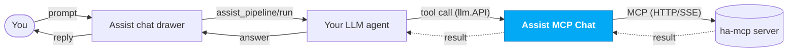

# Assist MCP Chat

A custom Home Assistant integration that turns Assist into an enriched
**chat drawer** backed by the unofficial
[ha-mcp](https://github.com/homeassistant-ai/ha-mcp) Model Context Protocol server.

It connects to your ha-mcp server, exposes its ~84 Home-Assistant-control tools to
Home Assistant's conversation agents as an LLM API, and replaces the centered Assist
dialog with a Markdown-rendering chat drawer — from the standard Assist entry points
(the Assist button, the 3-dot dashboard menu and the `a` keyboard shortcut, plus the
button and menu inside the mobile Companion app), with nothing else to open.

## How it works

This integration bundles and implements existing HA native components and integrations so it doesn't handle any sensitive information or keys. Everything is passed through HA's core `LLM API`.
This integration has no server nor makes internet requests. Just taps into existing APIs and interconnects them.

- **Backend:** an MCP client (built on the official `mcp` SDK) connects to
  your ha-mcp server, lists its tools and registers them as an `llm.API`. No model is
  bundled — you select an LLM with your existing conversation agent.
- **Frontend:** an enhanced Assist dialog that does more. It
  intercepts the Assist `show-dialog` event on the web — and, inside the mobile
  Companion app, the `assist/show` message the frontend sends over the external bus
  to the app's native Assist — and opens an `ha-drawer`-based chat that streams
  responses through the existing `assist_pipeline/run` WebSocket API and renders
  them with `ha-markdown`. (Native Companion-app gestures bypass the web frontend
  and still open stock Assist.)

On setup, Assist MCP Chat connects to the ha-mcp server, lists its tools and
registers them as an `llm.API`. Then, for each message (solid = request, dotted =
result):



## Installation

> Requires **Home Assistant 2026.3 or newer** (the mobile chat uses HA's native
> `ha-bottom-sheet`, introduced in 2026.3).

1. Install `ha-mcp`

   [](https://my.home-assistant.io/redirect/supervisor_add_addon_repository/?repository_url=https%3A%2F%2Fgithub.com%2Fhomeassistant-ai%2Fha-mcp)

2. Install this integration:

   [](https://my.home-assistant.io/redirect/hacs_repository/?owner=victorigualada&repository=ha-assist-mcp-chat&category=Integration)

3. Go to **Settings → Devices & services → Add integration → Assist MCP Chat**.
   - If ha-mcp runs as the **add-on** (Home Assistant OS / Supervised), the server
     **URL is prefilled** — just paste the **secret path** (the `/private_…`
     segment) from the add-on's config into the *Secret path* field.
   - Otherwise enter the full server **URL** (including the secret path).

4. Point an LLM agent at the tools: edit your conversation agent (for example Anthropic, OpenAI, Google, or Ollama) and set its **control Home Assistant** API to **ha-mcp** like in the picture below.
   
   

5. Ensure you use an LLM model that can use tools.

## Development

The frontend project lives in `frontend/` (repo root) and builds into the
integration's served bundle at `custom_components/assist_mcp_chat/frontend/`:

```bash
cd frontend
npm install
npm run build
```

The built bundle is git-ignored and shipped via the release zip (see
`.github/workflows/release.yml`), so install via HACS or a release — not by
cloning, which won't contain the built JS.

Backend tests use `pytest-homeassistant-custom-component`:

```bash
pip install pytest-homeassistant-custom-component
pytest tests
```

## Disclaimer

AI has been used during development of this integration.